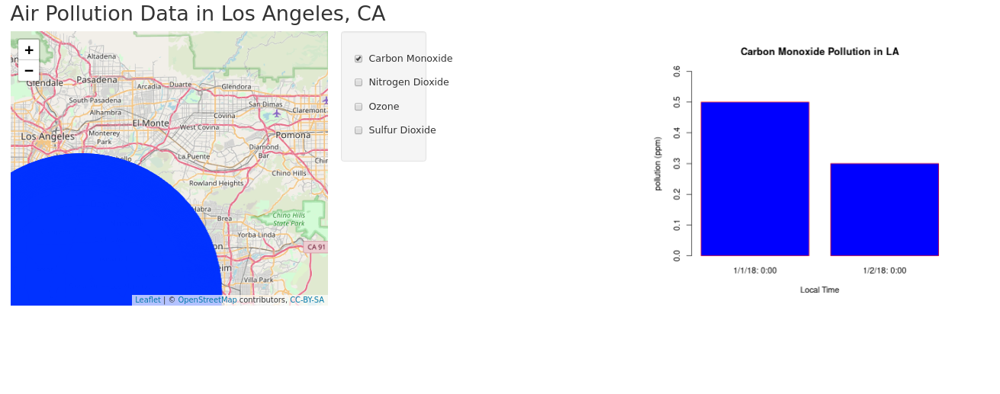

# NASA-SpaceHacks-SEA-2019
For our team  "No Logic".._.

## Our final R file is mapFinalV4.R

Website: https://www.spaceappschallenge.org/

Guide for Hackers: https://docs.google.com/document/d/1GNO5FXWjPzztgCiN_mNzgr-aa-fvGtqVTeddjfVjgxQ/edit

## Challenge we are doing:

https://2019.spaceappschallenge.org/challenges/living-our-world/surface-air-quality-mission/details

## Example DataSets:

https://www.state.gov/communications-outreach-and-partnerships/#space-apps

## Additional Data Sources:

USGS: https://data.usgs.gov/datacatalog/

## Where can I download NASA datasets from?

https://open.nasa.gov/open-data/

https://data.nasa.gov/

https://earthdata.nasa.gov/

https://earthexplorer.usgs.gov/

https://earthdata.nasa.gov/eosdis.daacs/sedac

(https://earthdata.nasa.gov/)

https://earthdata.nasa.gov/
 
## How can I meaninfgully use NASA datasets?
 
https://earthdata.nasa.gov/

## Basic and applied research:

https://scienceadntechnology.ipl.nasa.gov/research/research-topics-list

## How can I meaningfully use NASA datasets?:

Basic and applied research: https://www.nasa.gov/centers/johnson/partnerships/erc/sc/basic-and-applied-research
https://scienceandtechnology.jpl.nasa.gov/research/research-topics-list

Earth system monitoring: https://eospso.nasa.gov/content/nasa-earth-science-data

Socio-economic research: https://sedac.ciesin.columbia.edu/

Simulations and forecast: https://cloud.gsfc.nasa.gov/index.php?section=13

## Develop purpose built data catalogues
Data stories engage with larger audience: https://open.nasa.gov/data-stories/

Apps to ingest data for daily usage: https://www.nasa.gov/connect/apps.html

## Useful links:
Nasa Datasets by subject: https://www.nasa.gov/open/data.html

Apps examples: https://www.nasa.gov/connect/apps.html

Google Earth Engine 
QGIS https://qgis.org/en/site/

NASA Solar System Exploration https://solarsystem.nasa.gov/resources/all/?order=pub_date+desc&per_page=50&page=0&search=&fs=&fc=&ft=&dp=&category=

NASA Astrophysics data: https://nssdc.gsfc.nasa.gov/astro/

Python essential geospatial libraries https://medium.com/@chrieke/essential-geospatial-python-libraries-5d82fcc38731

Geospatial Analysis in R https://www.jessesadler.com/post/gis-with-r-intro/

NASA extragalactic database http://ned.ipac.caltech.edu/

Nighttime lights data https://earthdata.nasa.gov/learn/articles/viirs-dnb

## FrameWorks:

Leaflet: https://leafletjs.com/ 

D3: https://d3js.org/

Cool examples to reference:

http://ssz.fr/places/?fr#ac$//

## Leaflet and R:

https://www.earthdatascience.org/courses/earth-analytics/get-data-using-apis/leaflet-r/

https://rstudio.github.io/leaflet/

## Shiny and R:

https://gallery.shinyapps.io/086-bus-dashboard/

https://shiny.rstudio.com/gallery/

http://shiny.rstudio.com/articles/shinyapps.html

## NASA Data: https://data.nasa.gov/

## Random resources:

https://aqs.epa.gov/aqsweb/documents/codetables/methods_criteria.html

https://nex.nasa.gov/nex/static/htdocs/site/extra/opennex/

